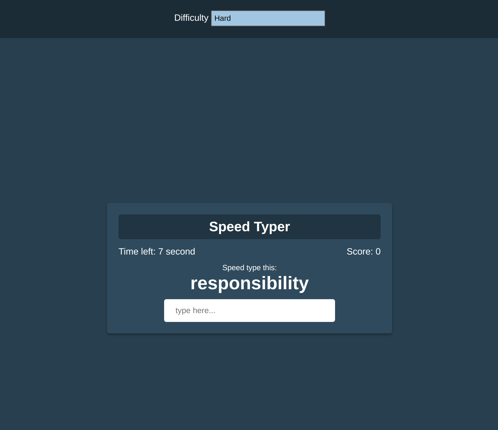

# speed-typer-game

A small Speed Typer Game that is intended to help my sister get better at typing. It is built using vanilla JavaScript

### Functions:

[The app](https://tn-space.github.io/speed-typer-game/) current has 999 most common words in the English language.

The app has many functions of a typical speed typer game:

- The game has 3 difficulty level currently (easy, medium, and hard)
- Once started, player has 10 seconds initially
- Each succesful word play typed, player get 1 point (score) and bonus time (seconds) depends on difficulty level.
- The game show highest score at the start screen

### Images:

